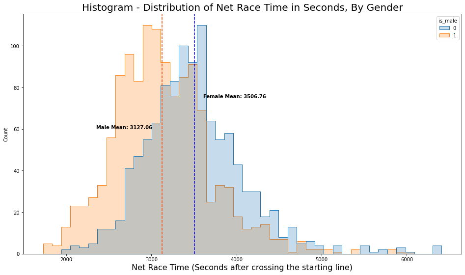
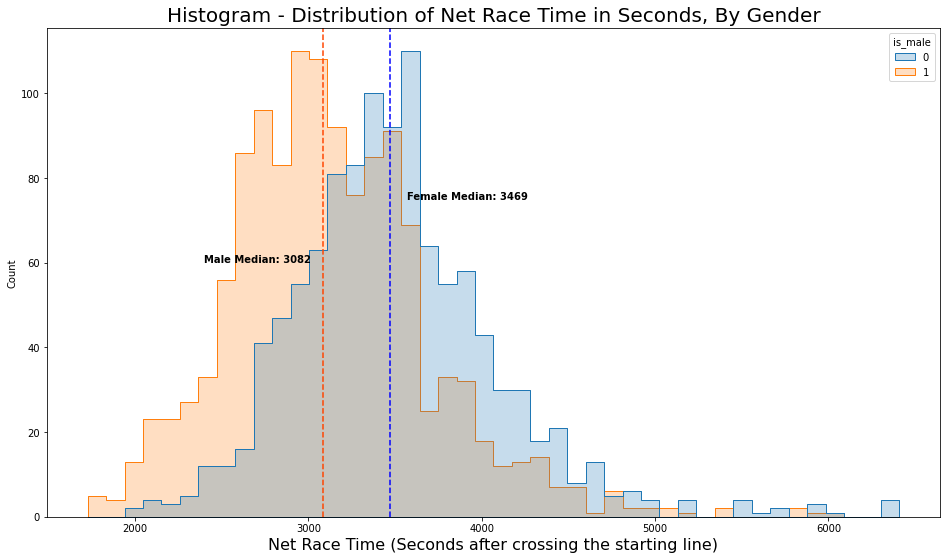
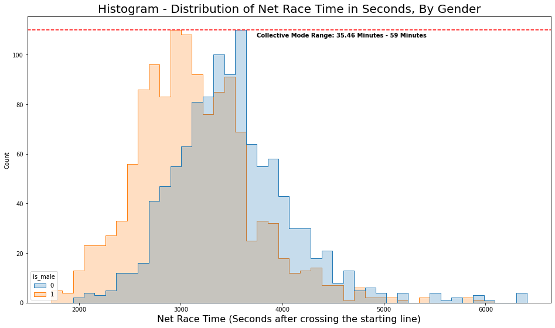
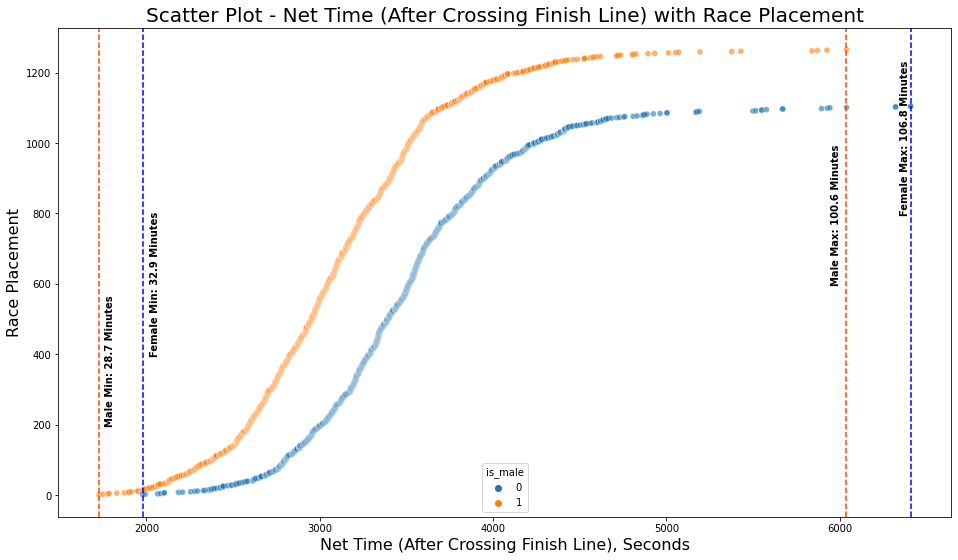
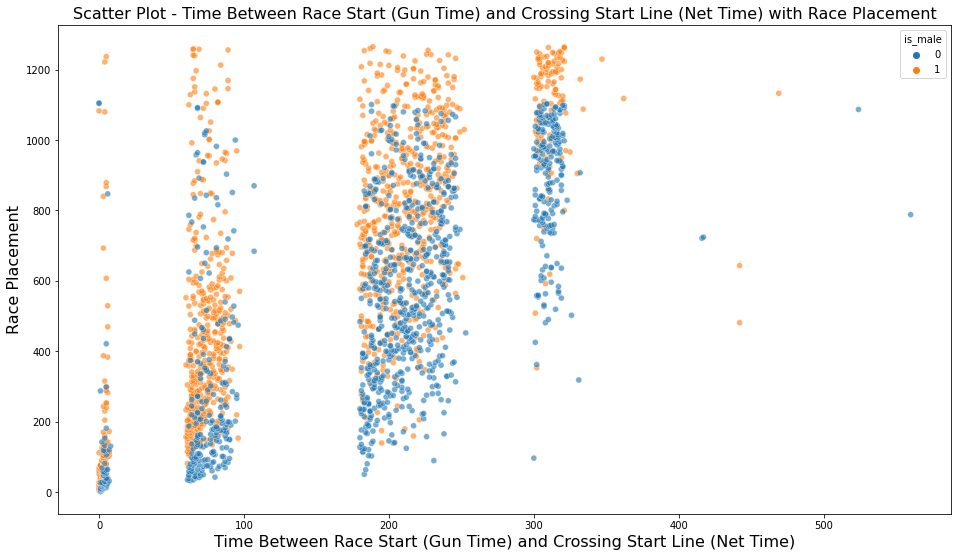
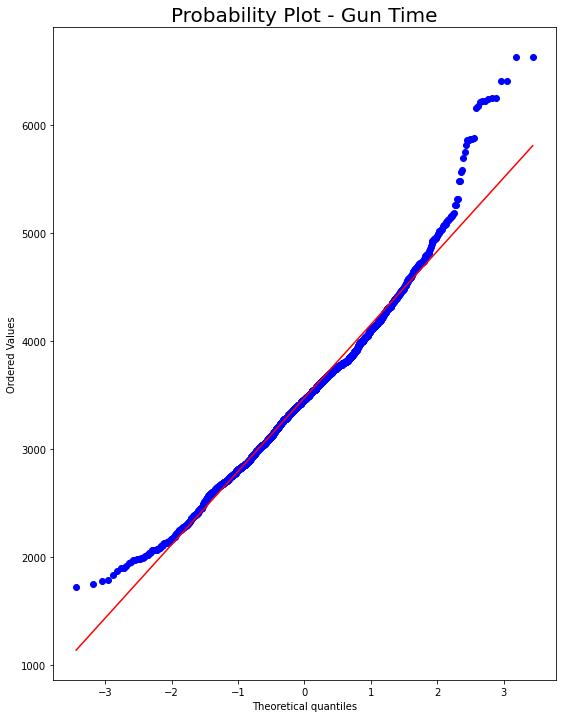
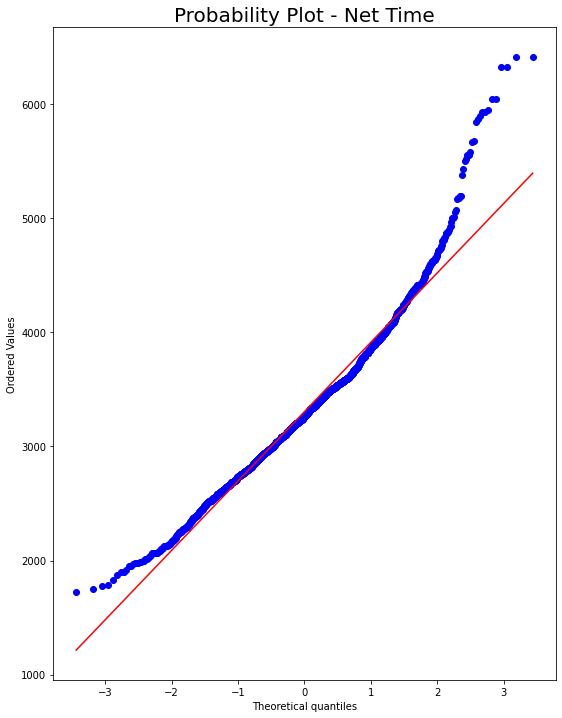
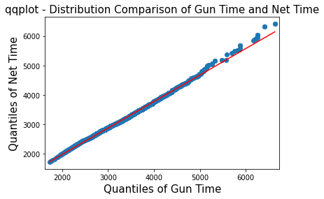
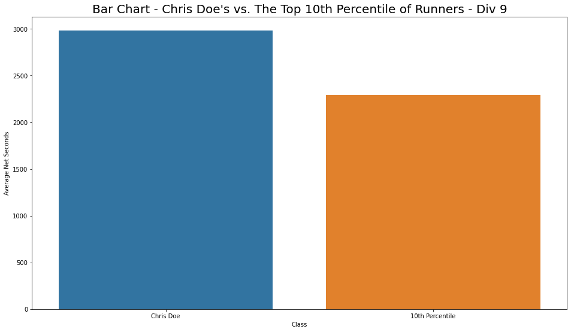

## Exercise questions
- What are the mean, median, mode, and range of the race results for all racers by gender?
- Analyze the difference between gun and net time race results.
- How much time separates Chris Doe from the top 10 percentile of racers of the same division?
- Compare the race results of each division.

## Data Background
Data used for this assessment is taken from the results of the 2006 Pike’s Peak 10k Race.

## Data Dictionary
As a part of the data cleaning process, I created a new dataframe from the data given for this assessment to simplify the exploratory process to answer the exercise questions. 

|Feature|Type|Description|
|---|---|---|
|**place**|*integer*|The order in which each racer finished relative to racers of the same gender|
|**div**|*integer*|Divisions that comprise of racers of the same gender and age group|
|**name** |*object*|Racer names|
|**gun_time_sec**|*integer*|Elapsed time from the formal start of the race when the racer crossed the finish line in seconds|
|**net_time_sec**|*integer*|Elapsed time from when the racer crossed the starting line and when the racer crossed the finish line in seconds|
|**is_male**|*categorical*|Classifying integer to indicate the gender of the racer (0 = female, 1 = male)|

## Methods

- Data Cleaning
- Statistical Methods
- Data Visualization

## Results Summary

### 1. What are the mean, median, mode, and range of the race results for all racers by gender?

**Mean.** 
- Female Mean: 3506 seconds or 58.4 minutes
- Male Mean: 3127 seconds or 52.11 minutes

Women, on average, took approximately 6.6 minutes or 400 seconds longer than men to finish the race.

**Median.** 
- Female Median: 3469 seconds or 57.81 minutes
- Male Median: 3082 seconds or 51.36 minutes

The median/midpoint of the race grouped by gender differs by approximately 400 seconds, with women being slower than men.

**Mode.** 
Disclaimer: There are multiple modes by gender due to the nature of the problem. All of these modes had either 4 or 5 runners who all finished at the same time in seconds - measured from crossing the starting line to crossing the finish line.

	Female Modes:
	•	2886 seconds or 48.1 minutes
	•	3095 seconds or 51.58 minutes
	•	3179 seconds or 52.98 minutes
	•	3209 seconds or 53.48 minutes
	•	3540 seconds or 59 minutes

	Male Modes:
	•	2128 seconds or 35.46 minutes
	•	2825 seconds or 47.08 minutes
	•	2843 seconds or 47.38 minutes
	•	2988 seconds or 49.8 minutes
	•	2998 seconds or 49.9 minutes
	•	3080 seconds or 51.3 minutes
	•	3126 seconds or 52.1 minutes
	•	3162 seconds or 52.7 minutes
	•	3264 seconds or 52.7 minutes
	•	3404 seconds or 56.7 minutes

The largest concentration of runners finished the race between 35 and 59 minutes after crossing the starting line.

**Range.**
- Female Range: 4431 seconds or 73.85 minutes
- Male Range: 4311 seconds or 71.85 minutes

Range between genders is relatively similar, only being 120 seconds or 2 minutes in difference. The race results for men are approximately 120 seconds or 2 minutes less diverse than the race results for women.

Using range, x minimums, and x maximums as metrics, this supports our understanding that men were generally faster than women. We also see that after about 4500 seconds or 75 minutes (1 hour 15 minutes), that’s where we tend to see much less concentration of runners finishing the race.

### 2. Analyze the difference between gun and net time race results.

**Mean differences.**
- Gun Time Mean: 3474.89 seconds or 57.9 minutes
- Net Time Mean: 3303.97 seconds or 55 minutes

The average difference between gun_time and net_time is approximately 171 seconds or 2.85 minutes. This is also the average wait time behind the starting line after the race has started.

**Range differences.**
- Gun Time Range: 1728 seconds - 6631 seconds or 28.8 minutes - 110 minutes
- Net Time Range: 1727 seconds - 6409 seconds or 28.7 minutes - 106 minutes

Based on the differences in range between gun time and net time, the initial difference is very small but as the race goes on, the difference becomes up to 4 minutes of waiting behind the starting line after the race has already started.

There does seem to be a pattern between the amount of time that it takes from the start of the race to cross the finish line and race placement- it seems that the longer it takes for certain runners to cross the starting line, the lower their chances are of placing well (low, as lower numbers for placements is the end goal). Because of the evident clustering on the visualizations, we can tell that it is likely that runners were allowed to run in batches- only a certain number of runners were able to or allowed to cross the starting line at certain points in the race. **Runners that were allowed to cross the starting line later tended to place worse in the race.**

**Examining distributions.**
With both gun time and net time, we see a visibly evident stray from the normal distribution on the lower and higher ends of the quartiles. This is likely to be the fastest and slowest runners performing at levels that do not match the rest of the runners in the distribution. These probability plots support the histograms that showed right skewed distributions, pulled by slower runners.

Based on this comparison qqplot, we see that the distribution for net time strays away from normal distribution on the right end slightly more than the gun time distribution does.

### 3. How much time separates Chris Doe from the top 10 percentile of racers in the same division?

Chris Doe would need to improve his time by 484 seconds or 8 minutes to be in the top 10 percentile of runners in his division. The top 10 percentile of runners are, on average, 23.29% faster than Chris Doe when comparing net time.

### 4. Compare the race results of each division.

Our earlier scatter plot which showed time between race start (gun time) and crossing the start line (net time) with race placement demonstrated that there is a decent correlation between the clusters of runners allowed to cross the starting line with placement. However, there is also an element of speed, age, and gender involved as, with just net time, we still see the same patterns.

Division 3, composed of teenage boys aged 15-19, was the fastest division. From there, we see an incremental increase towards the right side of the bar chart as age groups and divisions increase, with age groups and gender splitting the data into separate increments.

Division 4, composed of teenage girls aged 15-19, was the best ranking division overall, and placements followed a similar pattern to net time.

Division 12 spend the most amount of time behind the starting line, but there is not a clear pattern in the chart that demonstrates a correlation between division and group order when being allowed to start the race. After preliminary draft visualizations, bib number and division both likely do not have an effect on when racers got to pass the starting line. Without anything in the data to suggest otherwise, it is possible that clusters to cross the starting lines are determined on a first-come first-served basis in regards to registration.

